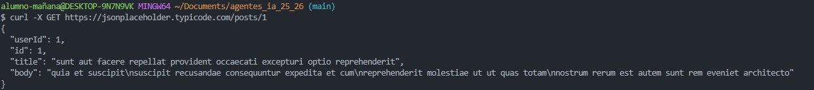
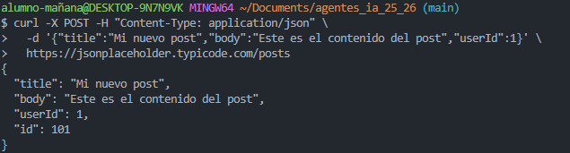
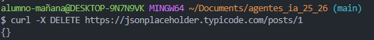
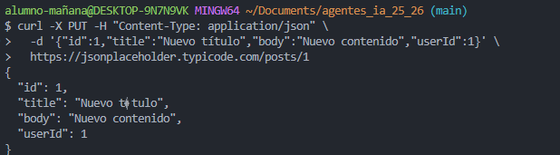
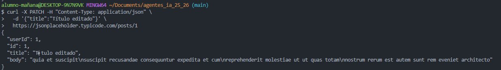

# Tarea CURL

* Crear un documento que ejemplifique todas las posibles opciones del comando CURL
* Usar alguna web fake rest api para probar las posibles funcionalidades del comando CURL
* Crear/Scripts/test.sh que lance todas los posibles test del comando curl para realizar GET,POST,DELETE,PUT,PATCH.

# cURL — guía simplificada

`curl` es una herramienta de línea de comandos para hacer peticiones a servidores. Aquí tienes un resumen de las opciones más usadas con ejemplos.

---

## Sintaxis básica

```bash
curl [opciones] URL
```

Ejemplo mínimo:

```bash
curl https://example.com
```

---

## Opciones comunes

### Métodos HTTP

* `-X GET|POST|PUT|PATCH|DELETE` → definir método.

```bash
curl -X GET https://jsonplaceholder.typicode.com/posts/1
```

### Enviar datos

* `-d "campo=valor"` → enviar datos (POST por defecto).
* `-H "Content-Type: application/json" -d '{"a":1}'` → enviar JSON.
* `-F "file=@archivo.txt"` → subir archivo (multipart/form-data).

### Cabeceras y autenticación

* `-H "Clave: Valor"` → añadir cabecera.
* `-u user:pass` → autenticación básica.
* `-H "Authorization: Bearer TOKEN"` → token.

### Cookies

* `-b cookies.txt` → enviar cookies desde archivo.
* `-c cookies.txt` → guardar cookies en archivo.

### Salida

* `-o archivo` → guardar respuesta.
* `-O` → guardar con nombre original.
* `-i` → incluir cabeceras en la salida.
* `-s` → silencioso.
* `-v` → modo detallado.

### Redirecciones y compresión

* `-L` → seguir redirecciones.
* `--compressed` → aceptar gzip/deflate.

### TLS/Certificados

* `-k` → ignorar certificado (inseguro).
* `--cert cert.pem --key key.pem` → usar certificado cliente.

### Tiempo y control

* `--max-time N` → límite de segundos.
* `--retry N` → reintentos.
* `--limit-rate 100K` → limitar velocidad.

---

## Ejemplos rápidos

GET con cabeceras:

```bash
curl -i -L -H "Accept: application/json" https://jsonplaceholder.typicode.com/posts/1
```

POST JSON:

```bash
curl -X POST -H "Content-Type: application/json" \
  -d '{"title":"foo","body":"bar","userId":1}' \
  https://jsonplaceholder.typicode.com/posts
```

Subir archivo:

```bash
curl -F "file=@foto.png" https://httpbin.org/post
```

Autenticación básica:

```bash
curl -u usuario:clave https://httpbin.org/basic-auth/usuario/clave
```

Guardar salida:

```bash
curl -o salida.json https://jsonplaceholder.typicode.com/posts
```

---

## Resumen de flags más usados

* `-X` método
* `-d` datos
* `-F` formulario/archivo
* `-H` cabecera
* `-u` auth básica
* `-o/-O` guardar salida
* `-i` incluir cabeceras
* `-s` silencioso
* `-v` verbose
* `-L` seguir redirecciones
* `-k` ignorar SSL

---

# Métodos HTTP con cURL

## 1. GET — Leer información

El método **GET** se usa para **leer información** del servidor sin modificar nada.

```bash
curl -X GET https://jsonplaceholder.typicode.com/posts/1
```



---

## 2. POST — Crear un recurso nuevo

El método **POST** se usa para **crear un recurso nuevo** en el servidor.

```bash
curl -X POST -H "Content-Type: application/json" \
  -d '{"title":"Mi nuevo post","body":"Este es el contenido del post","userId":1}' \
  https://jsonplaceholder.typicode.com/posts
```



---

## 3. DELETE — Borrar un recurso

El método **DELETE** se usa para **eliminar un recurso** del servidor.

```bash
curl -X DELETE https://jsonplaceholder.typicode.com/posts/1
```



---

## 4. PUT — Reemplazar un recurso completo

El método **PUT** se usa para **reemplazar un recurso completo**. Actualiza todos los campos del recurso aunque solo cambies uno.

```bash
curl -X PUT -H "Content-Type: application/json" \
  -d '{"id":1,"title":"Nuevo título","body":"Nuevo contenido","userId":1}' \
  https://jsonplaceholder.typicode.com/posts/1
```



---

## 5. PATCH — Actualizar parcialmente un recurso

El método **PATCH** se usa para **actualizar solo una parte** de un recurso sin reemplazarlo completamente.

```bash
curl -X PATCH -H "Content-Type: application/json" \
  -d '{"title":"Título editado"}' \
  https://jsonplaceholder.typicode.com/posts/1
```



---

*Fin de la guía simplificada.*
