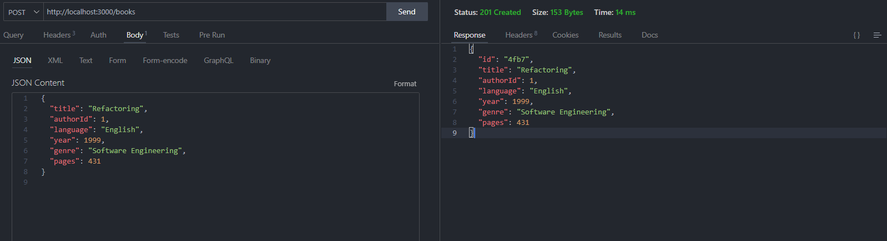
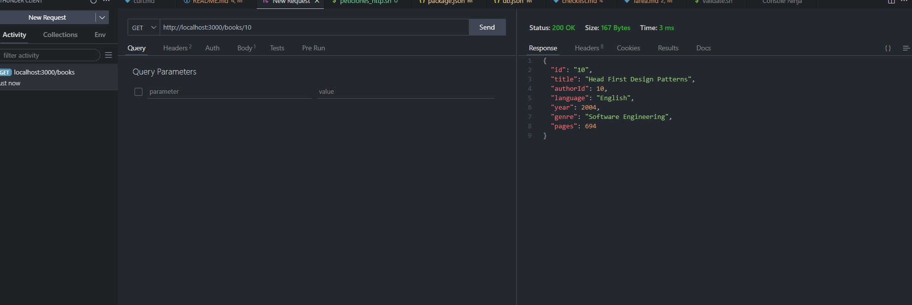
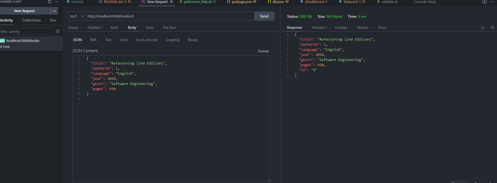
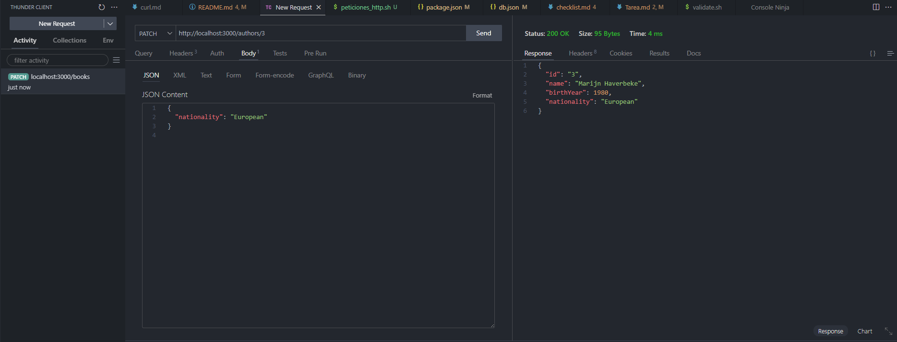
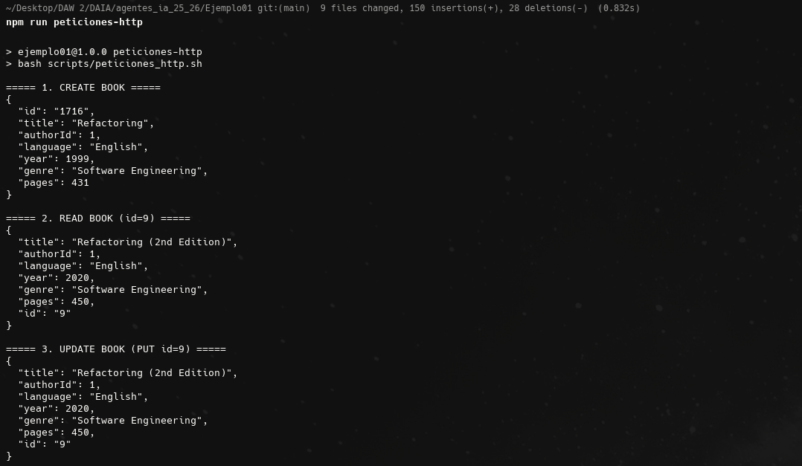
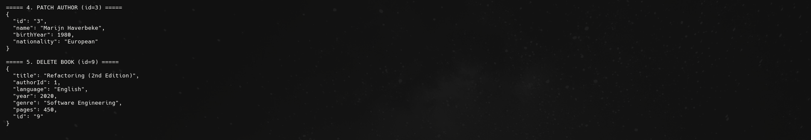

# Proyecto API CRUD con JSON Server

Este proyecto demuestra el uso de **Thunder Client** y **cURL** para realizar un CRUD básico contra una API REST simulada con **JSON Server**.  

La base de datos está en `db.json`, con dos recursos principales:
- `/books`
- `/authors`

---

# Checklist CRUD API

## Preparación
- [X] Tener `db.json` con `books` y `authors`
- [X] Instalar JSON Server: `npm install -g json-server`
- [X] Levantar API: `json-server --watch db.json --port 3000`
- [X] Instalar Thunder Client en VS Code

## Thunder Client
- [X] POST /books → Crear un libro
- [X] GET /books/:id → Leer el libro creado
- [X] PUT /books/:id → Actualizar libro completo
- [X] PATCH /authors/:id → Modificar autor
- [X] DELETE /books/:id → Borrar libro

## Script cURL
- [X] Crear `peticiones_http.sh` con los 5 comandos
- [X] Dar permisos: `chmod +x peticiones_http.sh`
- [X] Ejecutar: `./peticiones_http.sh` o `npm run peticiones-http`

## Package.json
- [X] Agregar script:
```json
{
  "scripts": {
    "peticiones-http": "bash scripts/peticiones_http.sh"
  }
}
```

# Proyecto API CRUD con JSON Server

Este proyecto demuestra el uso de **Thunder Client** y **cURL** para realizar un CRUD básico contra una API REST simulada con **JSON Server**.  

La base de datos está en `db.json`, con dos recursos principales:
- `/books`
- `/authors`

---

## 🚀 Ejercicio 1: Thunder Client

En **Thunder Client** se han creado peticiones para los dos recursos:
- `POST /books` → Crea un libro
    
- `GET /books/:id` → Lee un libro
    
- `PUT /books/:id` → Actualiza un libro completamente
    
- `PATCH /authors/:id` → Modifica parcialmente un autor
    
- `DELETE /books/:id` → Elimina un libro
    

---

## 🚀 Ejercicio 2: Script con cURL

Se creó el script **`peticiones_http.sh`** con 5 comandos que demuestran el flujo CRUD.




### Ejecución

```bash
./peticiones_http.sh
1. Asegúrate de tener **JSON Server** corriendo:

```bash
json-server --watch db.json --port 3000