# 🎓 Generador de Preguntas con Ollama

## 📋 Descripción

Aplicación web que utiliza **Inteligencia Artificial** (Ollama + Mistral) para generar preguntas de opción múltiple sobre temas de programación. Las preguntas se almacenan en SQLite para su posterior consulta y gestión.

**Temas disponibles**: JavaScript, Python, SQL, HTML/CSS

---

## 📑 Tabla de Contenidos

1. [Estructura del Proyecto](#1-estructura-del-proyecto)
2. [Backend](#2-backend)
3. [Validaciones](#3-validaciones)
4. [Errores y Dificultades Encontradas](#4-errores-y-dificultades-encontradas)

---

## 1. Estructura del Proyecto

```
generador-preguntas-ia-AH_JP/
├── backend/                    # Servidor Node.js + Express
│   ├── db.js                  # Configuración SQLite3
│   ├── prompts.js             # Temas y prompts para IA
│   ├── services.js            # Lógica de negocio
│   ├── routes.js              # Endpoints API REST
│   ├── server.js              # Servidor Express
│   ├── utils.js               # Funciones auxiliares
│   ├── Dockerfile             # Imagen Docker
│   └── package.json           # Dependencias
├── frontend/                   # Interfaz de usuario
│   ├── index.html             # Estructura HTML
│   ├── style.css              # Estilos CSS
│   └── main.js                # Lógica JavaScript
├── public/                     # Recursos públicos
│   └── img/                   # Capturas de validación
├── docker-compose.yml         # Orquestación de servicios
├── validacion.http            # Tests de API (REST Client)
└── README.md                  # Documentación
```

---

## 2. Backend

### 🗄️ `db.js` - Base de Datos

**Descripción**: Inicializa SQLite3 y crea la estructura de la base de datos.

**Esquema de la tabla `preguntas`**:

```javascript
import Database from 'better-sqlite3';

const db = new Database('./preguntas.db');

db.exec(`
  CREATE TABLE IF NOT EXISTS preguntas (
    id INTEGER PRIMARY KEY AUTOINCREMENT,
    tema TEXT NOT NULL,
    subtema TEXT,
    pregunta TEXT NOT NULL,
    opciones TEXT NOT NULL,      -- JSON con 4 opciones
    correcta TEXT NOT NULL,
    created_at DATETIME DEFAULT CURRENT_TIMESTAMP
  )
`);

export default db;
```

**Campos de la tabla**:

| Campo | Tipo | Descripción | Obligatorio |
|-------|------|-------------|-------------|
| `id` | INTEGER | Identificador único autoincremental | Sí (PK) |
| `tema` | TEXT | Tema principal (javascript, python, sql, html_css) | Sí |
| `subtema` | TEXT | Subtema específico (ej: "promesas") | No |
| `pregunta` | TEXT | Texto de la pregunta | Sí |
| `opciones` | TEXT | Array JSON con 4 opciones | Sí |
| `correcta` | TEXT | Respuesta correcta | Sí |
| `created_at` | DATETIME | Fecha y hora de creación | Automático |

---

### 📝 `prompts.js` - Temas y Prompts

**Descripción**: Define los temas disponibles y los prompts que se envían a la IA para generar preguntas.

**Estructura**:

```javascript
export const temas = [
  {
    id: 'javascript',
    nombre: 'JavaScript Avanzado',
    descripcion: 'ES6+, asincronía, promesas, closures, DOM',
    prompt: `Eres un profesor experto de JavaScript.
             Genera {num_preguntas} preguntas de opción múltiple sobre {subtema}.
             Cada pregunta debe tener exactamente 4 opciones.
             Marca claramente cuál es la correcta.
             
             Responde ÚNICAMENTE con un JSON en este formato exacto:
             {
               "preguntas": [
                 {
                   "pregunta": "texto de la pregunta",
                   "opciones": ["opcion1", "opcion2", "opcion3", "opcion4"],
                   "correcta": "opcion correcta"
                 }
               ]
             }`
  },
  {
    id: 'python',
    nombre: 'Python Avanzado',
    descripcion: 'Decoradores, generadores, comprehensions',
    prompt: `Eres un profesor experto de Python...`
  },
  {
    id: 'sql',
    nombre: 'SQL',
    descripcion: 'Consultas, joins, subconsultas, optimización',
    prompt: `Eres un profesor experto de SQL...`
  },
  {
    id: 'html_css',
    nombre: 'HTML y CSS',
    descripcion: 'Semántica, flexbox, grid, responsive',
    prompt: `Eres un profesor experto de HTML y CSS...`
  }
];
```

**Placeholders dinámicos**:
- `{num_preguntas}`: Número de preguntas a generar (1-5)
- `{subtema}`: Tema específico proporcionado por el usuario

---

### ⚙️ `services.js` - Lógica de Negocio

**Descripción**: Contiene toda la lógica de negocio de la aplicación, incluyendo la interacción con Ollama y la base de datos.

#### Función principal: `generarPreguntas()`

**Proceso completo**:

```javascript
import fetch from 'node-fetch';
import db from './db.js';
import { temas } from './prompts.js';

export const generarPreguntas = async (temaId, numPreguntas, subtema = 'conceptos generales') => {
  // 1. VALIDACIONES
  if (!temaId || !numPreguntas) {
    throw new Error('Debes indicar el tema y el número de preguntas');
  }
  
  if (!Number.isInteger(numPreguntas) || numPreguntas < 1 || numPreguntas > 5) {
    throw new Error('numPreguntas debe estar entre 1 y 5');
  }
  
  // 2. BUSCAR TEMA
  const tema = temas.find(t => t.id === temaId);
  if (!tema) {
    throw new Error(`Tema no válido. Temas disponibles: ${temas.map(t => t.id).join(', ')}`);
  }
  
  // 3. CONSTRUIR PROMPT
  const promptFinal = tema.prompt
    .replace('{num_preguntas}', numPreguntas)
    .replace('{subtema}', subtema);
  
  // 4. CONFIGURAR URL DE OLLAMA
  const AI_ENV = process.env.AI_ENV || "home";
  const URL_API = AI_ENV === "school" 
    ? process.env.AI_API_URL_SCHOOL 
    : process.env.AI_API_URL_HOME;
  
  // 5. LLAMAR A OLLAMA
  const controller = new AbortController();
  const timeoutId = setTimeout(() => controller.abort(), 60000); // 60s timeout
  
  try {
    const response = await fetch(`${URL_API}/api/generate`, {
      method: 'POST',
      headers: { 'Content-Type': 'application/json' },
      body: JSON.stringify({
        model: process.env.AI_MODEL || 'mistral:instruct',
        prompt: promptFinal,
        stream: false
      }),
      signal: controller.signal
    });
    
    clearTimeout(timeoutId);
    
    if (!response.ok) {
      throw new Error(`Error de Ollama: ${response.statusText}`);
    }
    
    // 6. PROCESAR RESPUESTA
    const data = await response.json();
    let respuestaIA = data.response;
    
    // Limpiar markdown si existe
    respuestaIA = respuestaIA.replace(/```json\n?/g, '').replace(/```\n?/g, '').trim();
    
    // 7. PARSEAR JSON
    const { preguntas } = JSON.parse(respuestaIA);
    
    if (!preguntas || !Array.isArray(preguntas)) {
      throw new Error('Formato de respuesta inválido de la IA');
    }
    
    // 8. GUARDAR EN BASE DE DATOS
    const preguntasGuardadas = [];
    const insert = db.prepare(`
      INSERT INTO preguntas (tema, subtema, pregunta, opciones, correcta)
      VALUES (?, ?, ?, ?, ?)
    `);
    
    for (const p of preguntas) {
      const info = insert.run(
        temaId,
        subtema,
        p.pregunta,
        JSON.stringify(p.opciones),
        p.correcta
      );
      
      preguntasGuardadas.push({
        id: info.lastInsertRowid,
        tema: temaId,
        subtema,
        pregunta: p.pregunta,
        opciones: JSON.stringify(p.opciones),
        correcta: p.correcta
      });
    }
    
    // 9. RETORNAR PREGUNTAS
    return preguntasGuardadas;
    
  } catch (error) {
    clearTimeout(timeoutId);
    if (error.name === 'AbortError') {
      throw new Error('Timeout: La IA tardó más de 60 segundos en responder');
    }
    throw error;
  }
};
```

**Configuración de entorno**:

```javascript
// Variables de entorno para Ollama
const AI_ENV = process.env.AI_ENV || "home";

// Selección de URL según entorno
const URL_API = AI_ENV === "school" 
  ? process.env.AI_API_URL_SCHOOL    // http://localhost:11434 (Ollama local)
  : process.env.AI_API_URL_HOME;     // https://jarvis.ieshlanz.es (Ollama remoto)
```

#### Otras funciones implementadas:

**`obtenerPreguntas(tema)`**
```javascript
export const obtenerPreguntas = (tema = null) => {
  let query = 'SELECT * FROM preguntas';
  let params = [];
  
  if (tema) {
    query += ' WHERE tema = ?';
    params.push(tema);
  }
  
  query += ' ORDER BY created_at DESC';
  
  const stmt = db.prepare(query);
  return stmt.all(...params);
};
```

**`obtenerPreguntaPorId(id)`**
```javascript
export const obtenerPreguntaPorId = (id) => {
  const stmt = db.prepare('SELECT * FROM preguntas WHERE id = ?');
  return stmt.get(id);
};
```

**`eliminarPregunta(id)`**
```javascript
export const eliminarPregunta = (id) => {
  const stmt = db.prepare('DELETE FROM preguntas WHERE id = ?');
  const info = stmt.run(id);
  return info.changes > 0;
};
```

**`limpiarTema(tema)`**
```javascript
export const limpiarTema = (tema) => {
  const stmt = db.prepare('DELETE FROM preguntas WHERE tema = ?');
  const info = stmt.run(tema);
  return info.changes; // Retorna número de filas eliminadas
};
```

---

### 🌐 `routes.js` - API REST

**Descripción**: Define todos los endpoints de la API REST para la gestión de preguntas.

```javascript
import express from 'express';
import * as services from './services.js';
import { temas } from './prompts.js';

const router = express.Router();

// Endpoint raíz - Info de la API
router.get('/', (req, res) => {
  res.json({
    nombre: 'API Generador de Preguntas con IA',
    version: '1.0.0',
    descripcion: 'API para generar preguntas de programación usando Ollama',
    endpoints: [
      'GET /api/',
      'GET /api/health',
      'GET /api/temas',
      'POST /api/generate',
      'GET /api/preguntas',
      'GET /api/preguntas/:id',
      'DELETE /api/preguntas/:id',
      'DELETE /api/preguntas/tema/:tema'
    ]
  });
});

// Health Check
router.get('/health', async (req, res) => {
  try {
    const AI_ENV = process.env.AI_ENV || "home";
    const URL_API = AI_ENV === "school" 
      ? process.env.AI_API_URL_SCHOOL 
      : process.env.AI_API_URL_HOME;
    
    const response = await fetch(`${URL_API}/api/tags`);
    const ollamaStatus = response.ok ? 'connected' : 'disconnected';
    
    res.json({
      status: 'ok',
      ollama: ollamaStatus,
      timestamp: new Date().toISOString()
    });
  } catch (error) {
    res.json({
      status: 'ok',
      ollama: 'disconnected',
      error: error.message,
      timestamp: new Date().toISOString()
    });
  }
});

// Obtener temas disponibles
router.get('/temas', (req, res) => {
  res.json(temas.map(t => ({
    id: t.id,
    nombre: t.nombre,
    descripcion: t.descripcion
  })));
});

// Generar preguntas
router.post('/generate', async (req, res) => {
  try {
    const { tema, numPreguntas, subtema } = req.body;
    
    const preguntas = await services.generarPreguntas(tema, numPreguntas, subtema);
    
    res.json({
      success: true,
      preguntas,
      mensaje: `Se generaron ${preguntas.length} preguntas para el tema "${tema}"`
    });
  } catch (error) {
    res.status(400).json({
      success: false,
      error: error.message,
      codigo: 400
    });
  }
});

// Obtener preguntas (con filtro opcional)
router.get('/preguntas', (req, res) => {
  try {
    const { tema } = req.query;
    const preguntas = services.obtenerPreguntas(tema);
    res.json(preguntas);
  } catch (error) {
    res.status(500).json({
      success: false,
      error: error.message,
      codigo: 500
    });
  }
});

// Obtener pregunta por ID
router.get('/preguntas/:id', (req, res) => {
  try {
    const { id } = req.params;
    const pregunta = services.obtenerPreguntaPorId(parseInt(id));
    
    if (!pregunta) {
      return res.status(404).json({
        success: false,
        error: 'Pregunta no encontrada',
        codigo: 404
      });
    }
    
    res.json(pregunta);
  } catch (error) {
    res.status(500).json({
      success: false,
      error: error.message,
      codigo: 500
    });
  }
});

// Eliminar pregunta por ID
router.delete('/preguntas/:id', (req, res) => {
  try {
    const { id } = req.params;
    const eliminada = services.eliminarPregunta(parseInt(id));
    
    if (!eliminada) {
      return res.status(404).json({
        success: false,
        error: 'Pregunta no encontrada',
        codigo: 404
      });
    }
    
    res.json({
      success: true,
      mensaje: 'Pregunta eliminada correctamente'
    });
  } catch (error) {
    res.status(500).json({
      success: false,
      error: error.message,
      codigo: 500
    });
  }
});

// Limpiar todas las preguntas de un tema
router.delete('/preguntas/tema/:tema', (req, res) => {
  try {
    const { tema } = req.params;
    const eliminadas = services.limpiarTema(tema);
    
    res.json({
      success: true,
      eliminadas,
      mensaje: `Se eliminaron ${eliminadas} preguntas del tema "${tema}"`
    });
  } catch (error) {
    res.status(500).json({
      success: false,
      error: error.message,
      codigo: 500
    });
  }
});

export { router };
```

#### Tabla de Endpoints:

| Método | Endpoint | Descripción | Body/Params | Response |
|--------|----------|-------------|-------------|----------|
| GET | `/api/` | Info general de la API | - | Info JSON |
| GET | `/api/health` | Estado del servidor y Ollama | - | Status JSON |
| GET | `/api/temas` | Lista de temas disponibles | - | Array temas |
| POST | `/api/generate` | Generar preguntas con IA | `{ tema, numPreguntas, subtema? }` | Preguntas generadas |
| GET | `/api/preguntas` | Obtener todas las preguntas | `?tema=X` (opcional) | Array preguntas |
| GET | `/api/preguntas/:id` | Obtener pregunta por ID | `:id` | Pregunta |
| DELETE | `/api/preguntas/:id` | Eliminar pregunta específica | `:id` | Confirmación |
| DELETE | `/api/preguntas/tema/:tema` | Eliminar todas de un tema | `:tema` | Número eliminadas |

---

### 🖥️ `server.js` - Servidor Express

**Descripción**: Configura y arranca el servidor Express con todas las configuraciones necesarias.

```javascript
import express from 'express';
import cors from 'cors';
import dotenv from 'dotenv';
import path from 'path';
import { fileURLToPath } from 'url';
import { router } from './routes.js';

// Configurar __dirname para ES modules
const __filename = fileURLToPath(import.meta.url);
const __dirname = path.dirname(__filename);

// Cargar variables de entorno
dotenv.config();

const app = express();
const PORT = process.env.PORT || 3005;

// Middlewares
app.use(cors());
app.use(express.json());

// Logging middleware
app.use((req, res, next) => {
  console.log(`${req.method} ${req.path}`);
  next();
});

// API Routes
app.use('/api', router);

// Servir frontend
app.use(express.static(path.join(__dirname, '../frontend')));

// Ruta catch-all para SPA
app.get('*', (req, res) => {
  res.sendFile(path.join(__dirname, '../frontend/index.html'));
});

// Iniciar servidor
app.listen(PORT, () => {
  console.log('='.repeat(50));
  console.log(`🚀 Servidor corriendo en http://localhost:${PORT}`);
  console.log(`📚 API disponible en http://localhost:${PORT}/api`);
  console.log(`🎨 Frontend en http://localhost:${PORT}`);
  console.log('='.repeat(50));
});
```

---

### 📦 Dependencias

```json
{
  "name": "generador-preguntas-backend",
  "version": "1.0.0",
  "type": "module",
  "scripts": {
    "start": "node server.js",
    "dev": "nodemon server.js"
  },
  "dependencies": {
    "express": "^4.18.2",
    "cors": "^2.8.5",
    "dotenv": "^17.0.0",
    "better-sqlite3": "^9.2.2",
    "node-fetch": "^3.3.0"
  },
  "devDependencies": {
    "nodemon": "^3.0.1"
  }
}
```

---

## 3. Checklist de pruebas manuales 

- [x] Backend levanta sin errores

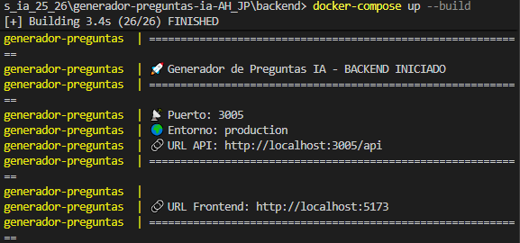

- [x] Ollama responde correctamente
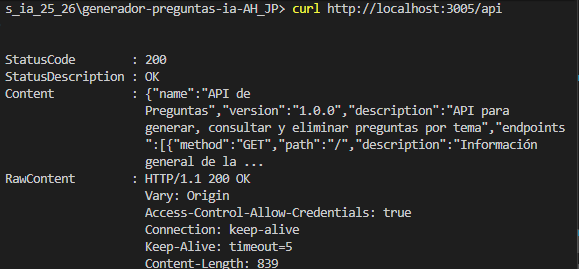

- [x] Frontend carga sin problemas
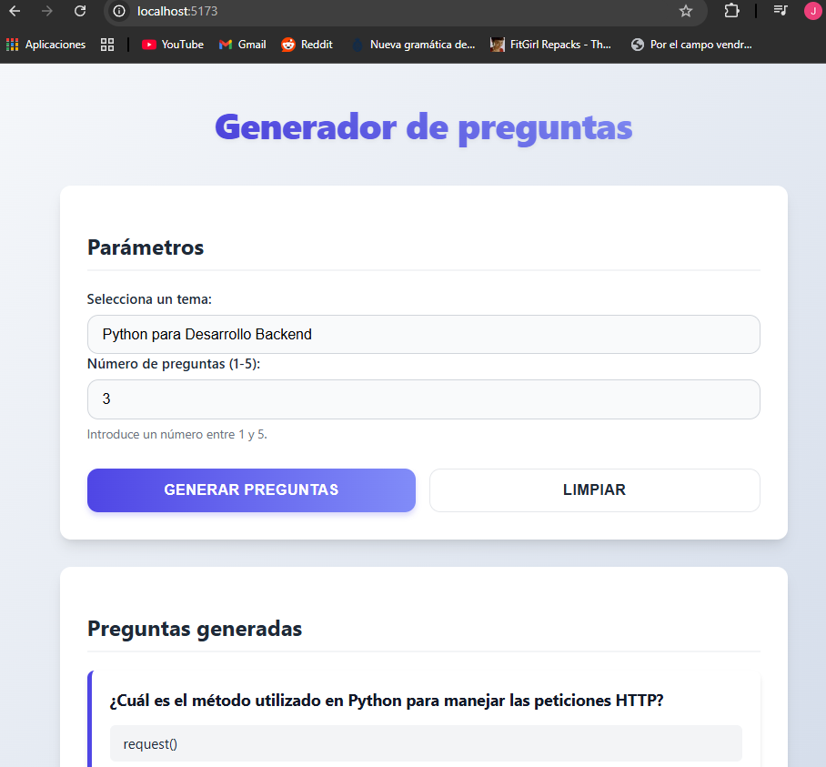

- [x] Selector de temas funciona

- [x] Generar preguntas (JavaScript, Seguridad, Normativa) funciona

- [x] Preguntas se guardan en la base de datos
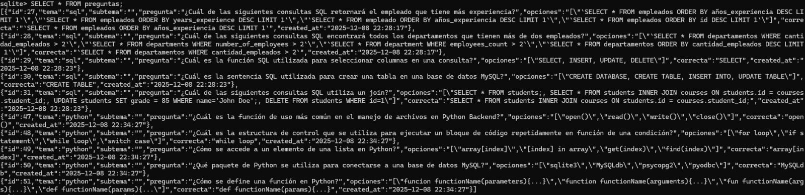

- [x] Preguntas se muestran en el frontend
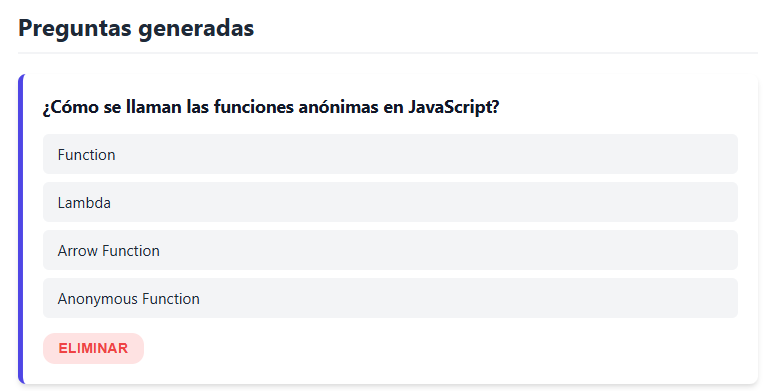

- [x] Eliminar pregunta funciona


- [x] Limpiar tema funciona


- [x] Validaciones bloquean datos incorrectos


- [x] Mensajes de error claros si Ollama no responde


- [x] Indicador de carga visible y funcional


## 4. Validaciones

### 4.1📸 Capturas de Pantalla - Validación de la API

Todas las validaciones se realizaron usando **REST Client** de VS Code con el archivo `validacion.http`.

---

#### 1️⃣ Eliminar pregunta por ID

```http
DELETE http://localhost:3005/api/preguntas/1
```

**Respuesta esperada**:
```json
{
  "success": true,
  "mensaje": "Pregunta eliminada correctamente"
}
```

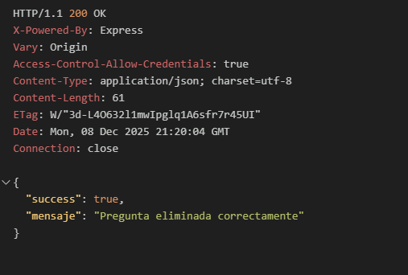

---

#### 2️⃣ Eliminar todas las preguntas de un tema

```http
DELETE http://localhost:3005/api/preguntas/tema/javascript
```

**Respuesta esperada**:
```json
{
  "success": true,
  "eliminadas": 5,
  "mensaje": "Se eliminaron 5 preguntas del tema javascript"
}
```

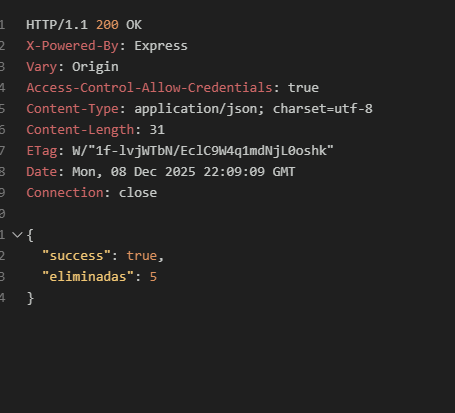

---

#### 3️⃣ Error: Número de preguntas fuera de rango

```http
POST http://localhost:3005/api/generate
Content-Type: application/json

{
  "tema": "javascript",
  "numPreguntas": 10
}
```

**Respuesta esperada**:
```json
{
  "success": false,
  "error": "numPreguntas debe estar entre 1 y 5",
  "codigo": 400
}
```

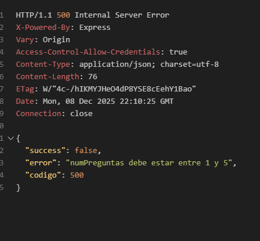

---

#### 4️⃣ Error: Falta el parámetro tema

```http
POST http://localhost:3005/api/generate
Content-Type: application/json

{
  "numPreguntas": 3
}
```

**Respuesta esperada**:
```json
{
  "success": false,
  "error": "Debes indicar el tema y el número de preguntas",
  "codigo": 400
}
```

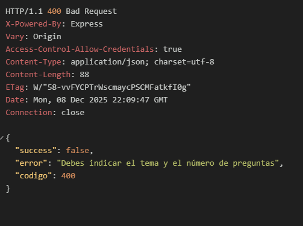

---

#### 5️⃣ Generar preguntas exitosamente

```http
POST http://localhost:3005/api/generate
Content-Type: application/json

{
  "tema": "javascript",
  "numPreguntas": 3,
  "subtema": "promesas y async/await"
}
```

**Respuesta esperada**:
```json
{
  "success": true,
  "preguntas": [
    {
      "id": 1,
      "tema": "javascript",
      "subtema": "promesas y async/await",
      "pregunta": "¿Qué devuelve una función async?",
      "opciones": "[\"Una promesa\",\"Un callback\",\"Undefined\",\"Un observable\"]",
      "correcta": "Una promesa"
    }
  ],
  "mensaje": "Se generaron 3 preguntas para el tema \"javascript\""
}
```

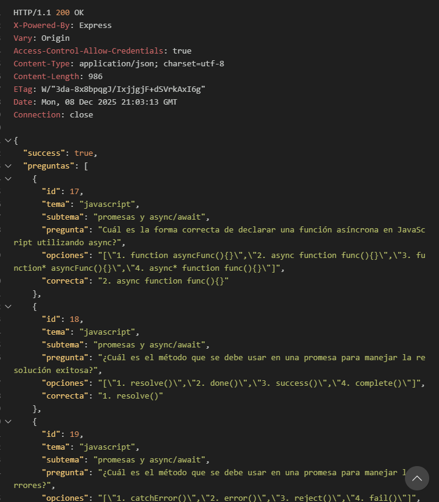

---

#### 6️⃣ Obtener pregunta por ID

```http
GET http://localhost:3005/api/preguntas/1
```

**Respuesta esperada**:
```json
{
  "id": 1,
  "tema": "javascript",
  "subtema": "promesas y async/await",
  "pregunta": "¿Qué devuelve una función async?",
  "opciones": "[\"Una promesa\",\"Un callback\",\"Undefined\",\"Un observable\"]",
  "correcta": "Una promesa",
  "created_at": "2024-12-10 10:30:00"
}
```

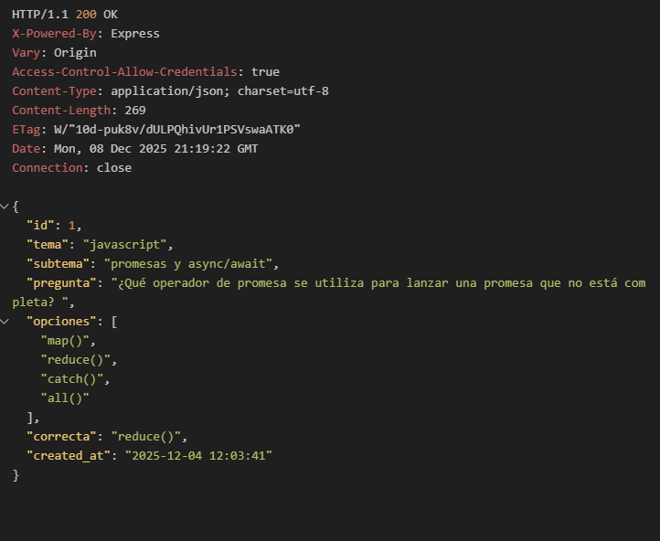

---

#### 7️⃣ Obtener preguntas por tema

```http
GET http://localhost:3005/api/preguntas?tema=javascript
```

**Respuesta esperada**:
```json
[
  {
    "id": 1,
    "tema": "javascript",
    "subtema": "promesas",
    "pregunta": "¿Qué devuelve una función async?",
    "opciones": "[\"Una promesa\",\"Un callback\",\"Undefined\",\"Un observable\"]",
    "correcta": "Una promesa"
  },
  {
    "id": 2,
    "tema": "javascript",
    "subtema": "arrays",
    "pregunta": "¿Qué hace el método map()?",
    "opciones": "[\"Transforma\",\"Filtra\",\"Reduce\",\"Ordena\"]",
    "correcta": "Transforma cada elemento"
  }
]
```

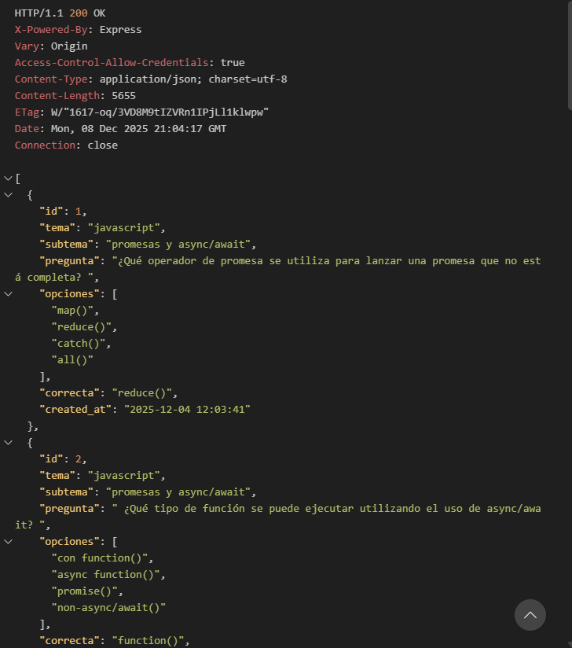

---

#### 8️⃣ Health Check

```http
GET http://localhost:3005/api/health
```

**Respuesta esperada**:
```json
{
  "status": "ok",
  "ollama": "connected",
  "timestamp": "2024-12-10T10:30:00.000Z"
}
```

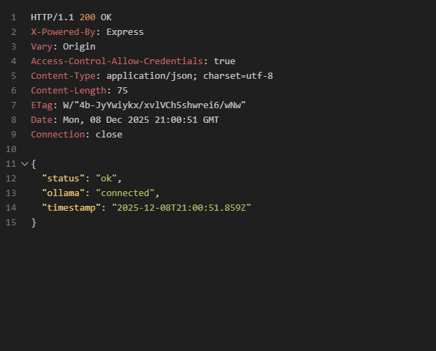

---

#### 9️⃣ Información general de la API

```http
GET http://localhost:3005/api/
```

**Respuesta esperada**:
```json
{
  "nombre": "API Generador de Preguntas",
  "version": "1.0.0",
  "descripcion": "API para generar preguntas con IA usando Ollama",
  "endpoints": [
    "GET /api/health",
    "GET /api/temas",
    "POST /api/generate",
    "GET /api/preguntas",
    "DELETE /api/preguntas/:id"
  ]
}
```

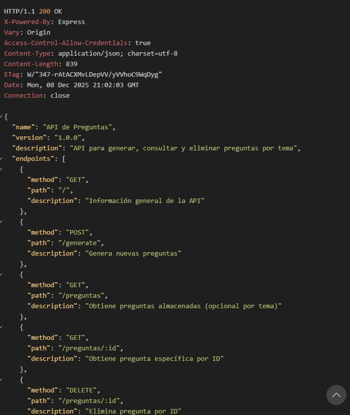

---

#### 🔟 Lista de temas disponibles

```http
GET http://localhost:3005/api/temas
```

**Respuesta esperada**:
```json
[
  {
    "id": "javascript",
    "nombre": "JavaScript Avanzado",
    "descripcion": "ES6+, async/await, promesas, closures"
  },
  {
    "id": "python",
    "nombre": "Python Avanzado",
    "descripcion": "Decoradores, generadores, comprehensions"
  },
  {
    "id": "sql",
    "nombre": "SQL",
    "descripcion": "Consultas, joins, subconsultas, optimización"
  }
]
```

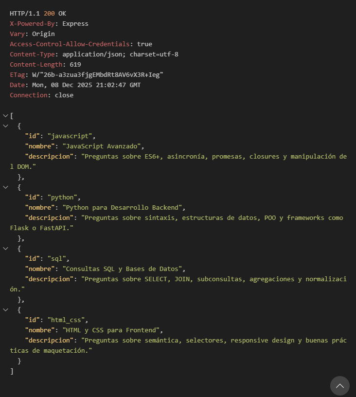

---

#### 1️⃣1️⃣ Error: Tema no válido

```http
POST http://localhost:3005/api/generate
Content-Type: application/json

{
  "tema": "ruby",
  "numPreguntas": 2
}
```

**Respuesta esperada**:
```json
{
  "success": false,
  "error": "Tema no válido. Temas disponibles: javascript, python, sql, html_css",
  "codigo": 400
}
```

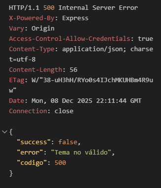

---

### 📊 Resumen de Validaciones

| # | Endpoint | Método | Estado | Descripción |
|---|----------|--------|--------|-------------|
| 1 | `/api/health` | GET | ✅ | Servidor y Ollama conectados |
| 2 | `/api/` | GET | ✅ | Información de la API |
| 3 | `/api/temas` | GET | ✅ | Lista de temas disponibles |
| 4 | `/api/generate` | POST | ✅ | Generación exitosa de preguntas |
| 5 | `/api/preguntas?tema=X` | GET | ✅ | Filtrado por tema funciona |
| 6 | `/api/preguntas/:id` | GET | ✅ | Obtención por ID funciona |
| 7 | `/api/preguntas/:id` | DELETE | ✅ | Eliminación individual funciona |
| 8 | `/api/preguntas/tema/:tema` | DELETE | ✅ | Eliminación por tema funciona |
| 9 | `/api/generate` (sin tema) | POST | ❌ | Error 400 - Validación correcta |
| 10 | `/api/generate` (fuera rango) | POST | ❌ | Error 400 - Validación correcta |
| 11 | `/api/generate` (tema inválido) | POST | ❌ | Error 400 - Validación correcta |

---

### 🎯 Validaciones Implementadas por Endpoint

#### ✅ **POST /api/generate**
- ✓ Tema es obligatorio
- ✓ numPreguntas es obligatorio
- ✓ numPreguntas debe ser un número entero
- ✓ numPreguntas debe estar entre 1 y 5
- ✓ El tema debe existir en la lista de temas disponibles
- ✓ Timeout de 60 segundos en llamadas a Ollama
- ✓ Validación de formato JSON de respuesta de IA

#### ✅ **GET /api/preguntas/:id**
- ✓ El ID debe ser un número válido
- ✓ El ID debe existir en la base de datos
- ✓ Retorna 404 si no se encuentra

#### ✅ **GET /api/preguntas?tema=X**
- ✓ El parámetro tema es opcional
- ✓ Si se proporciona tema, debe ser válido
- ✓ Retorna array vacío si no hay preguntas
- ✓ Formato de respuesta consistente

#### ✅ **DELETE /api/preguntas/:id**
- ✓ El ID debe existir
- ✓ Retorna 404 si no se encuentra
- ✓ Confirmación de eliminación

#### ✅ **DELETE /api/preguntas/tema/:tema**
- ✓ El tema debe existir
- ✓ Confirmación del número de preguntas eliminadas
- ✓ Funciona aunque no haya preguntas del tema

---

## Errores y Dificultades Encontradas

Durante el desarrollo del proyecto nos encontramos con varios problemas que requirieron soluciones específicas. A continuación se detallan los más importantes:

---

### 🔴 Error 1: Problemas con Ollama - Conexión y Timeouts

#### **Problema 1.1: Health Check mostraba "disconnected"**

**Síntomas**:
```json
{
  "status": "ok",
  "ollama": "disconnected",
  "error": "fetch failed"
}
```

**Causa**:
- La URL de Ollama estaba incorrecta en el `.env`
- Ollama no estaba corriendo en el momento de hacer la petición
- Puerto bloqueado o firewall activo

**Solución implementada**:

```javascript
// routes.js - Health Check mejorado
router.get('/health', async (req, res) => {
  try {
    const AI_ENV = process.env.AI_ENV || "home";
    const URL_API = AI_ENV === "school" 
      ? process.env.AI_API_URL_SCHOOL 
      : process.env.AI_API_URL_HOME;
    
    console.log(`🔍 Verificando Ollama en: ${URL_API}`);
    
    const response = await fetch(`${URL_API}/api/tags`, {
      method: 'GET',
      headers: { 'Content-Type': 'application/json' }
    });
    
    const ollamaStatus = response.ok ? 'connected' : 'disconnected';
    
    res.json({
      status: 'ok',
      ollama: ollamaStatus,
      url: URL_API,
      timestamp: new Date().toISOString()
    });
  } catch (error) {
    console.error('❌ Error conectando con Ollama:', error.message);
    res.json({
      status: 'ok',
      ollama: 'disconnected',
      error: error.message,
      timestamp: new Date().toISOString()
    });
  }
});
```

**Lecciones aprendidas**:
- Siempre verificar que Ollama esté corriendo: `ollama serve`
- Comprobar la URL en el `.env` antes de ejecutar
- Añadir logs para depurar problemas de conexión

---

#### **Problema 1.2: Timeout al generar preguntas**

**Síntomas**:
```javascript
Error: Timeout: La IA tardó más de 60 segundos en responder
```

**Causa**:
- Ollama tardaba mucho en generar preguntas complejas
- No había timeout configurado, quedaba la petición colgada
- Modelo muy pesado o sistema con pocos recursos

**Solución implementada**:

```javascript
// services.js - Timeout de 60 segundos
export const generarPreguntas = async (temaId, numPreguntas, subtema) => {
  // ... validaciones ...
  
  // Configurar timeout
  const controller = new AbortController();
  const timeoutId = setTimeout(() => {
    console.warn('⚠️ Timeout: Abortando petición a Ollama');
    controller.abort();
  }, 60000); // 60 segundos
  
  try {
    const response = await fetch(`${URL_API}/api/generate`, {
      method: 'POST',
      headers: { 'Content-Type': 'application/json' },
      body: JSON.stringify({
        model: process.env.AI_MODEL || 'mistral:instruct',
        prompt: promptFinal,
        stream: false
      }),
      signal: controller.signal  // ← Importante: pasar el signal
    });
    
    clearTimeout(timeoutId);  // Limpiar timeout si responde a tiempo
    
    // ... resto del código ...
    
  } catch (error) {
    clearTimeout(timeoutId);
    
    if (error.name === 'AbortError') {
      throw new Error('Timeout: La IA tardó más de 60 segundos en responder');
    }
    throw error;
  }
};
```

**Recomendaciones**:
- Usar modelos más ligeros: `mistral:instruct` en lugar de `llama2:70b`
- Limitar el número de preguntas a 3-5
- Aumentar timeout a 90-120s si es necesario
- Simplificar el prompt para respuestas más rápidas

---

#### **Problema 1.3: Respuestas mal formateadas de Ollama**

**Síntomas**:
```
Error: Unexpected token 'G', "Genero pre"... is not valid JSON
```

La IA a veces devolvía texto antes o después del JSON:

```
Genero preguntas sobre JavaScript:
```json
{
  "preguntas": [...]
}
```

```
**Causa**:
- La IA incluía markdown o texto adicional
- No seguía estrictamente el formato JSON solicitado

**Solución implementada**:

```javascript
// services.js - Limpiar respuesta antes de parsear
const data = await response.json();
let respuestaIA = data.response;

console.log('📥 Respuesta cruda de Ollama:', respuestaIA);

// Limpiar markdown y texto adicional
respuestaIA = respuestaIA
  .replace(/```json\n?/g, '')   // Eliminar ```json
  .replace(/```\n?/g, '')        // Eliminar ```
  .trim();                       // Eliminar espacios

// Buscar el primer { y el último }
const inicioJSON = respuestaIA.indexOf('{');
const finJSON = respuestaIA.lastIndexOf('}');

if (inicioJSON !== -1 && finJSON !== -1) {
  respuestaIA = respuestaIA.substring(inicioJSON, finJSON + 1);
}

console.log('🧹 Respuesta limpia:', respuestaIA);

// Ahora sí, parsear
const { preguntas } = JSON.parse(respuestaIA);
```

**Mejora en el prompt**:

```javascript
// prompts.js - Prompt más estricto
prompt: `Eres un profesor experto de JavaScript.
         Genera {num_preguntas} preguntas de opción múltiple sobre {subtema}.
         
         IMPORTANTE: Responde ÚNICAMENTE con un JSON válido.
         NO incluyas texto adicional, ni markdown, ni explicaciones.
         NO uses \`\`\`json ni \`\`\`.
         
         Formato EXACTO:
         {
           "preguntas": [
             {
               "pregunta": "...",
               "opciones": ["A", "B", "C", "D"],
               "correcta": "A"
             }
           ]
         }`
```

**Lecciones aprendidas**:
- Siempre limpiar la respuesta antes de parsear JSON
- Ser muy específico en el prompt sobre el formato
- Añadir logs para ver qué devuelve realmente la IA
- Tener un plan B: intentar extraer el JSON del texto

---

### 🔴 Error 2: Problemas con el parseo del JSON

#### **Problema 2.1: Estructura inconsistente del JSON**

**Síntomas**:
```javascript
TypeError: Cannot read property 'preguntas' of undefined
```

A veces la IA devolvía estructuras diferentes:

```json
// A veces era así:
{
  "preguntas": [...]
}

// Y a veces así:
[
  { "pregunta": "...", "opciones": [...], "correcta": "..." }
]
```

**Solución implementada**:

```javascript
// services.js - Validación robusta de la estructura
try {
  const parsed = JSON.parse(respuestaIA);
  
  let preguntas;
  
  // Si es un array directo
  if (Array.isArray(parsed)) {
    preguntas = parsed;
  }
  // Si tiene la propiedad "preguntas"
  else if (parsed.preguntas && Array.isArray(parsed.preguntas)) {
    preguntas = parsed.preguntas;
  }
  // Si tiene la propiedad "questions" (en inglés)
  else if (parsed.questions && Array.isArray(parsed.questions)) {
    preguntas = parsed.questions;
  }
  else {
    throw new Error('Formato de respuesta inválido de la IA');
  }
  
  // Validar que cada pregunta tenga los campos necesarios
  for (const p of preguntas) {
    if (!p.pregunta || !p.opciones || !p.correcta) {
      throw new Error('Pregunta incompleta: falta pregunta, opciones o correcta');
    }
    
    if (!Array.isArray(p.opciones) || p.opciones.length !== 4) {
      throw new Error('Cada pregunta debe tener exactamente 4 opciones');
    }
  }
  
  // Si llegamos aquí, todo está bien
  return preguntas;
  
} catch (error) {
  console.error('❌ Error parseando JSON:', error.message);
  console.error('📄 JSON problemático:', respuestaIA);
  throw new Error(`Error al procesar respuesta de IA: ${error.message}`);
}
```

**Lecciones aprendidas**:
- Nunca asumir que la IA devolverá el formato exacto
- Validar SIEMPRE la estructura antes de usar los datos
- Tener múltiples estrategias de parseo (array directo, objeto con propiedad, etc.)
- Logs detallados para debug

---

### 🔴 Error 3: Problemas con CORS

#### **Problema 3.1: CORS bloqueando peticiones desde el frontend**

**Síntomas**:
```
Access to fetch at 'http://localhost:3005/api/generate' from origin 'http://localhost:5173' 
has been blocked by CORS policy: No 'Access-Control-Allow-Origin' header is present
```

**Causa**:
- El backend no tenía configurado CORS
- El frontend estaba en un puerto diferente (5173 de Vite)

**Solución implementada**:

```javascript
// server.js - Configurar CORS correctamente
import cors from 'cors';

const app = express();

// Opción 1: CORS abierto (desarrollo)
app.use(cors());

// Opción 2: CORS específico (producción)
app.use(cors({
  origin: ['http://localhost:5173', 'http://localhost:3005'],
  methods: ['GET', 'POST', 'DELETE'],
  allowedHeaders: ['Content-Type'],
  credentials: true
}));

app.use(express.json());
// ... resto del código
```

**Lecciones aprendidas**:
- Siempre configurar CORS en desarrollo
- En producción, especificar orígenes permitidos
- El orden de los middlewares importa: CORS debe ir antes de las rutas

---

#### **Problema 3.2: Preflight requests fallando**

**Síntomas**:
El navegador hacía peticiones OPTIONS que fallaban:

```
OPTIONS http://localhost:3005/api/generate 404 (Not Found)
```

**Causa**:
- Las peticiones DELETE y POST complejas activan preflight (OPTIONS)
- No teníamos manejador para OPTIONS

**Solución**:
El middleware `cors()` de Express maneja automáticamente las peticiones OPTIONS, pero hay que asegurarse de que esté antes de las rutas:

```javascript
// server.js - Orden correcto
app.use(cors());           // ← CORS primero
app.use(express.json());   // ← Después JSON parser
app.use('/api', router);   // ← Al final las rutas
```

---

### 🔴 Error 4: Problemas con las rutas del frontend

#### **Problema 4.1: 404 al servir archivos estáticos**

**Síntomas**:
```
GET http://localhost:3005/style.css 404 (Not Found)
GET http://localhost:3005/main.js 404 (Not Found)
```

**Causa**:
- La ruta del `express.static` estaba mal configurada
- `__dirname` no funcionaba con ES modules

**Solución implementada**:

```javascript
// server.js - Configurar __dirname para ES modules
import { fileURLToPath } from 'url';
import path from 'path';

// Recrear __dirname en ES modules
const __filename = fileURLToPath(import.meta.url);
const __dirname = path.dirname(__filename);

// Servir archivos estáticos correctamente
app.use(express.static(path.join(__dirname, '../frontend')));

// Ruta catch-all para SPA (al final)
app.get('*', (req, res) => {
  res.sendFile(path.join(__dirname, '../frontend/index.html'));
});
```

**Estructura de carpetas correcta**:
```
proyecto/
├── backend/
│   └── server.js          ← Servidor aquí
├── frontend/              ← Frontend un nivel arriba
│   ├── index.html
│   ├── style.css
│   └── main.js
```

**Lecciones aprendidas**:
- En ES modules (`type: "module"`), `__dirname` no existe por defecto
- Hay que recrearlo con `fileURLToPath` y `path.dirname`
- El path relativo es desde donde se ejecuta el servidor

---

#### **Problema 4.2: Rutas de API conflictuando con archivos estáticos**

**Síntomas**:
Al abrir `http://localhost:3005/api` devolvía el `index.html` en lugar del JSON de la API

**Causa**:
- El middleware `express.static` estaba antes de las rutas de API
- Express intentaba servir un archivo llamado "api" antes de ejecutar las rutas

**Solución**:

```javascript
// server.js - ORDEN CORRECTO de middlewares

// 1. CORS (primero)
app.use(cors());

// 2. JSON parser
app.use(express.json());

// 3. API routes (antes de static)
app.use('/api', router);

// 4. Archivos estáticos (después de API)
app.use(express.static(path.join(__dirname, '../frontend')));

// 5. Catch-all (al final)
app.get('*', (req, res) => {
  res.sendFile(path.join(__dirname, '../frontend/index.html'));
});
```

**Regla de oro**: 
> Las rutas específicas (`/api`) deben ir ANTES que los middlewares genéricos (`express.static`)

---

#### **Problema 4.3: Importación de módulos en el frontend**

**Síntomas**:
```
Uncaught SyntaxError: Cannot use import statement outside a module
```

**Causa**:
- El `<script>` en el HTML no tenía `type="module"`

**Solución**:

```html
<!-- index.html - Añadir type="module" -->
<!DOCTYPE html>
<html lang="es">
<head>
  <!-- ... -->
</head>
<body>
  <!-- ... -->
  
  <!-- ❌ Incorrecto -->
  <script src="main.js"></script>
  
  <!-- ✅ Correcto -->
  <script type="module" src="main.js"></script>
</body>
</html>
```

---

### 📊 Resumen de Soluciones Aplicadas

| Problema | Causa | Solución |
|----------|-------|----------|
| **Ollama desconectado** | URL incorrecta, no estaba corriendo | Verificar `.env`, logs detallados |
| **Timeout** | Peticiones muy largas | AbortController con 60s timeout |
| **JSON mal formateado** | IA incluía markdown | Limpiar con regex antes de parsear |
| **Estructura inconsistente** | IA cambiaba formato | Validación múltiple (array, objeto, etc.) |
| **CORS bloqueado** | No configurado | `app.use(cors())` antes de rutas |
| **404 en archivos estáticos** | `__dirname` no existía | `fileURLToPath` + orden correcto |
| **API conflictúa con static** | Orden de middlewares | API antes de `express.static` |
| **Import no funciona** | Falta `type="module"` | Añadir en `<script>` |

---

### 💡 Mejores Prácticas Aprendidas

1. **Validación exhaustiva**: Nunca confiar en que la IA devolverá el formato exacto
2. **Logs detallados**: Añadir `console.log` en puntos críticos para debug
3. **Timeouts siempre**: Cualquier petición externa debe tener timeout
4. **Orden de middlewares**: CORS → JSON → API → Static → Catch-all
5. **ES Modules**: Recordar que `__dirname` no existe, hay que recrearlo
6. **Prompts específicos**: Cuanto más detallado el prompt, mejor la respuesta de la IA
7. **Manejo de errores**: Try-catch en TODAS las funciones async
8. **Testing continuo**: Usar `validacion.http` para probar cada endpoint

---

**🎉 Todos los problemas fueron resueltos y documentados para futuras referencias**