# Parte 3: Documentación CRUD con Curl

## Crear estudiante (POST)

- Este comando crea un nuevo usuario con los datos que se pasan como parametro a la funcion. El comando es:

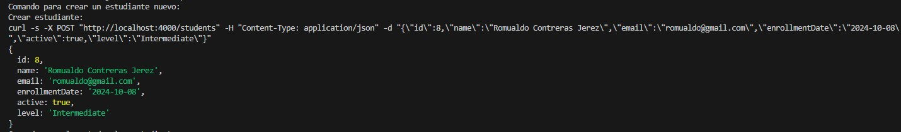
</br>

- El flag -X indica el tipo de operacion HTTP que se va a utilizar (en este caso POST).
- El flag -H indica el tipo de información (tipo de cabecera) que se le va a pasar para poder crear el nuevo estudiante.
- El flag -d sirve para especificar la informacion que se va a subir al servidor.
- En la parte final aparece la url (direccion del servidor en el que se va a insertar la informacion) de nuestro servidor.

## Leer todos los estudiantes (GET)

- Este comando devuelve un listado con todos los estudiantes que hay en la base de datos. El comando es:

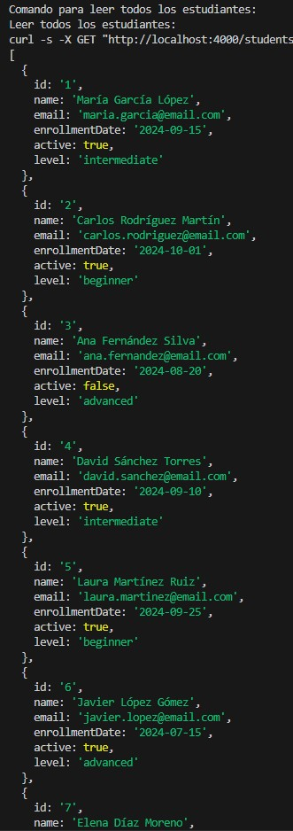
</br>

- El flag -X indica el tipo de operacion HTTP que se va a utilizar (en este caso GET).

- En la parte final aparece la url (direccion del servidor en el que se va a insertar la informacion) de nuestro servidor y la seccion de la cual vamos a sacar la información.

## Leer estudiante por ID (GET)

- Este comando devuelve el estudiante cuyo id coincide con el id que se ha pasado como parametro. El comando es:

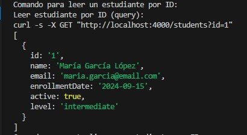
</br>

- El flag -X indica el tipo de operacion HTTP que se va a utilizar (en este caso POST).

- En la parte final aparece la url (direccion del servidor en el que se va a insertar la informacion) de nuestro servidor con la diferencia de que en la url especificamos el id del estudiante que queremos ver, en este caso es el numero 1.

## Actualizar un estudiante (PUT)

- Este comando actualiza la informacion del estudiante cuyo id coincide con el id que se ha pasado como parametro, reemplazando toda la informacion del estudiante por la informacion que se ha pasado como parametro. El comando es:

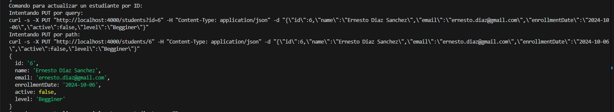
</br>

- El flag -X indica el tipo de operacion HTTP que se va a utilizar (en este caso POST).
- El flag -H indica el tipo de información (tipo de cabecera) que se le va a pasar para poder crear el nuevo estudiante.
- El flag -d sirve para especificar la informacion que se va a subir al servidor.
- En la parte final aparece la url (direccion del servidor en el que se va a insertar la informacion) de nuestro servidor. Además de especificar la seccion estudiantes y el id del usuario al que se le va a aplicar la modificacion.

## Actualizar parcialmente un estudiante (PATCH)

- Este comando actualiza la informacion del estudiante cuyo id coincide con el id que se ha pasado como parametro, reemplazando solo la informacion contenida en el parametro que se ha pasado, es decir, solo modifica los campos que se especifican en el comando. El comando es:


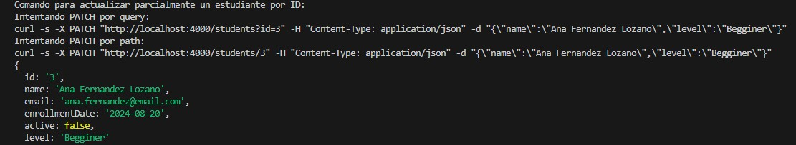
</br>

- El flag -X indica el tipo de operacion HTTP que se va a utilizar (en este caso POST).
- El flag -H indica el tipo de información (tipo de cabecera) que se le va a pasar para poder crear el nuevo estudiante.
- El flag -d sirve para especificar la informacion que se va a subir al servidor.
- En la parte final aparece la url (direccion del servidor en el que se va a insertar la informacion) de nuestro servidor. Además de especificar la seccion estudiantes y el id del usuario al que se le va a aplicar la modificacion.

## Eliminar un estudiante (DELETE)

- Este comando elimina la informacion del usuario cuyo id coincide con el id que se ha pasado como parametro. El comando es:

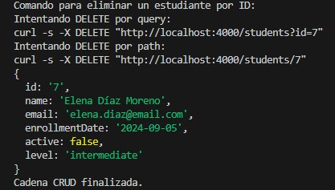
</br>

- El flag -X indica el tipo de operacion HTTP que se va a utilizar (en este caso GET).

- En la parte final aparece la url (direccion del servidor en el que se va a insertar la informacion) de nuestro servidor y la seccion de la cual vamos a sacar la información acompañada del id del estudiante que queremos eliminar.

# Parte 4: Thunder Client – CRUD Students API

Este apartado muestra el desarrollo de las pruebas realizadas con **Thunder Client** para la API de estudiantes usando la base de datos `db.json`.

---

## 4.1 ⚙ Configuración

Dado que la versión free de Thunder Client **no permite colecciones ni entornos de variables**, todas las peticiones se realizaron directamente con la URL completa.

* **Base URL**: `http://localhost`
* **Puerto**: `4000`
* **Recurso principal**: `/students`
* **Recursos secundarios**: `/enrollments`

Ejemplo de endpoint completo:
`http://localhost:4000/students`

---

## 4.2 📡 Peticiones

Se realizaron las siguientes peticiones HTTP contra la API de estudiantes:

1. **CREATE Student (POST)**
2. **GET All Students (GET)**
3. **GET Student by ID (GET)**
4. **UPDATE Student (PUT)**
5. **PATCH Student (PATCH)**
6. **DELETE Student (DELETE)**

---

## 4.3 📸 Capturas de pantalla

A continuación se muestran las capturas de pantalla de cada petición realizada con Thunder Client.

### 1. CREATE Student (POST)

Request a `http://localhost:4000/students` con body en formato JSON.


Headers usados en la petición:
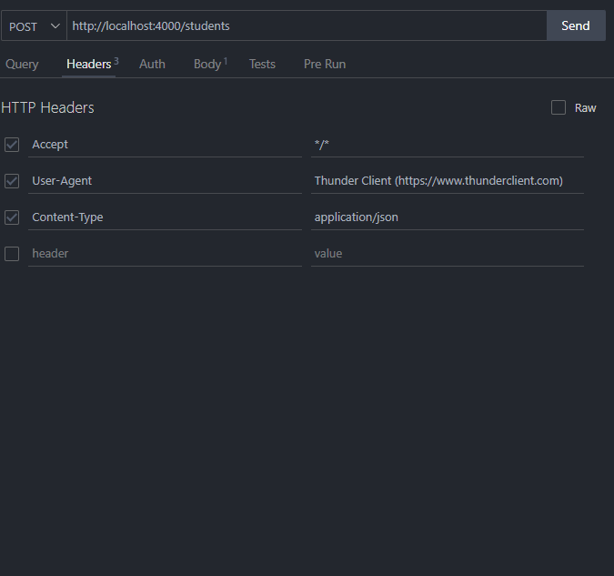

---

### 2. GET All Students (GET)

Request a `http://localhost:4000/students` para listar todos los estudiantes.


---

### 3. GET Student by ID (GET)

Request a `http://localhost:4000/students/1` para consultar un estudiante en particular.
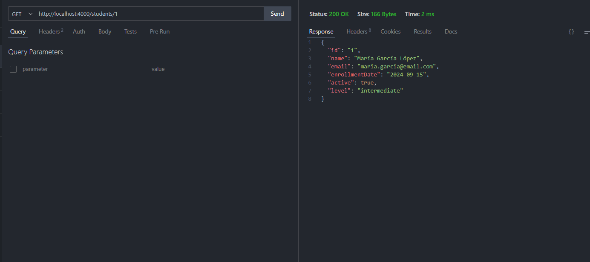

---

### 4. UPDATE Student (PUT)

Request a `http://localhost:4000/students/2` con body JSON para reemplazar los datos de un estudiante.

* Debido a que es una operación de reemplazo total, es necesario enviar todos los campos del recurso.

Los datos antes y después de la actualización son:


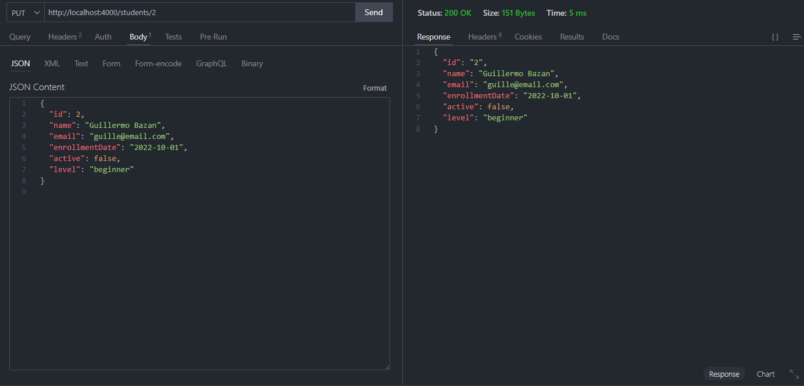

---

### 5. PATCH Student (PATCH)

Request a `http://localhost:4000/students/3` con body parcial en JSON para modificar solo algunos campos.

Los datos antes y después de la actualización son:


---

### 6. DELETE Student (DELETE)

Request a `http://localhost:4000/enrollments/4` para eliminar un estudiante.
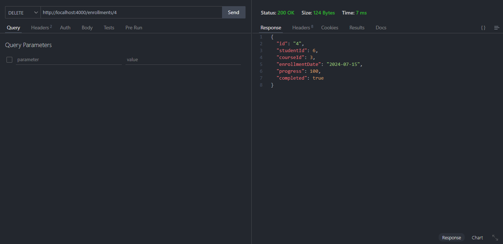

---

## 4.4 📝 Documentación

Para usar Thunder Client con esta API:

1. Instalar la dependencia JSON Server si no está instalada:

   ```bash
   npm install -g json-server
   ```

2. Iniciar el servidor JSON Server con el archivo `db.json`:

   ```bash
   json-server --watch db.json --port 4000
   ```

# Parte 5: REST Client – CRUD Students API

Este apartado muestra el desarrollo de las pruebas realizadas con **REST Client** de VS Code para la API de estudiantes usando la base de datos `db.json`. Se incluyen operaciones CRUD completas, filtros y el uso de variables configuradas para mantener el archivo limpio y organizado.

---

## 5.1 ⚙ Configuración

Se creó un archivo llamado `peticiones-crud.http` en la raíz del proyecto con todas las operaciones CRUD.

   **Archivo**: `peticiones-crud.http`
   **Variables definidas en el archivo**:

```http
@baseUrl = http://localhost
@port = 4000
@apiUrl = {{baseUrl}}:{{port}}/students
@ContentType = application/json
```

 **Notas**:

- REST Client **no lee `.env`**, por lo que todas las variables deben definirse dentro del archivo `.http`.
- Cada petición está separada con `###` y tiene comentarios descriptivos para facilitar la comprensión.

---

## 5.2 📡 Peticiones realizadas

Se implementaron las siguientes operaciones CRUD sobre el recurso `students`:

1. **CREATE Student (POST)** – Crear un nuevo estudiante .
2. **READ All Students (GET)** – Obtener todos los estudiantes.
3. **READ Student by ID (GET)** – Consultar un estudiante específico.
4. **READ Students activos (GET)** – Filtrar estudiantes cuyo campo `active` sea `true`.
5. **READ Students por nivel (GET)** – Filtrar estudiantes por el campo `level`.
6. **UPDATE Student (PUT)** – Actualizar todos los campos de un estudiante.
7. **PATCH Student (PATCH)** – Actualizar campos específicos de un estudiante.
8. **DELETE Student (DELETE)** – Eliminar un estudiante.

---

## 5.3 📸 Capturas de pantalla

Cada captura debe mostrar **request completa** (método, URL, headers y body) y **response completa** (status, headers y body).

### 1. CREATE Student (POST)

Request a `{{apiUrl}}` con body en JSON.

- En esta peticion se crea un nuevo estudiante con los datos proporcionados en el body. El metodo utilizado es POST. Y la URL completa se forma con las variables definidas al inicio del archivo.
- Ademas se especifica el header Content-Type para indicar que el body es de tipo JSON. Y se necesario incluir todos los campos del estudiante en el body para que la creacion sea exitosa si no da error.

**Captura ejemplo**:
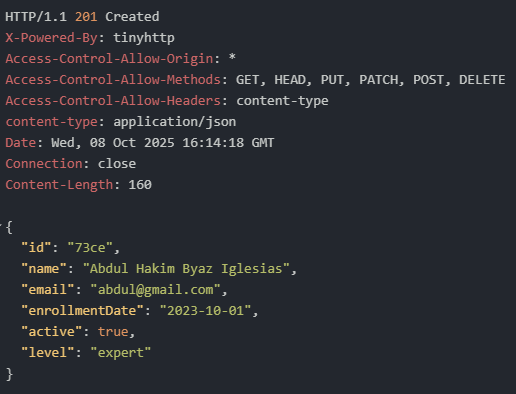

---

### 2. GET All Students (GET)

Request a `{{apiUrl}}` para listar todos los estudiantes.

- En esta peticion se muestran todos los estudiantes que hay en la base de datos. El metodo utilizado es GET. Y la URL completa se forma con las variables definidas al inicio del archivo.
- No es necesario incluir ningun header ni body en esta peticion ya que solo se esta solicitando informacion.

**Captura ejemplo**:
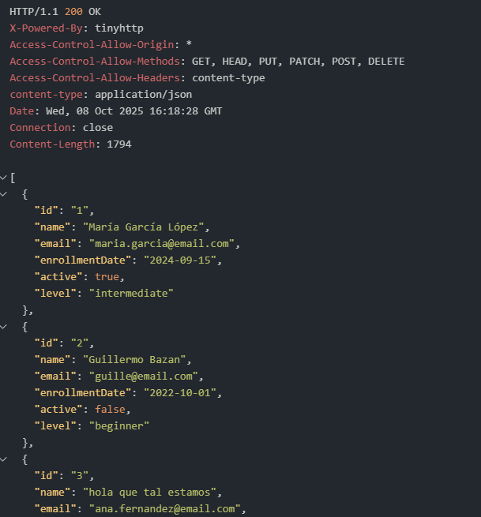

---

### 3. GET Student by ID (GET)

Request a `{{apiUrl}}/2` para consultar un estudiante específico.

- En esta peticion se muestra un estudiante en particular cuyo id es 2. El metodo utilizado es GET. Y la URL completa se forma con las variables definidas al inicio del archivo.
- No es necesario incluir ningun header ni body en esta peticion ya que solo se esta solicitando informacion.
- La respuesta debe incluir todos los campos del estudiante.

**Captura ejemplo**:
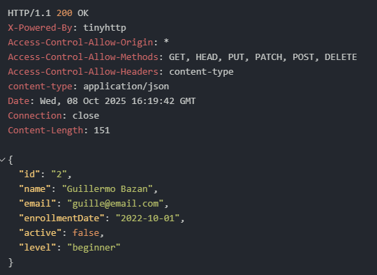

---

### 4. GET Students activos (GET)

Request a `{{apiUrl}}?active=true` para filtrar solo estudiantes activos.

- En esta peticion se muestran todos los estudiantes cuyo campo active es true. El metodo utilizado es GET. Y la URL completa se forma con las variables definidas al inicio del archivo.
- No es necesario incluir ningun header ni body en esta peticion ya que solo se esta solicitando informacion.

**Captura ejemplo**:
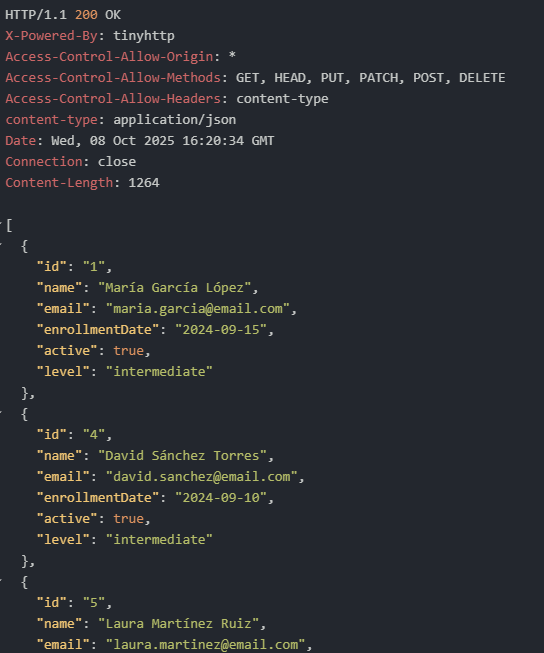

---

### 5. GET Students por nivel (GET)

Request a `{{apiUrl}}?level=intermediate` para filtrar por nivel.

- En esta peticion se muestran todos los estudiantes cuyo campo level es intermediate. El metodo utilizado es GET. Y la URL completa se forma con las variables definidas al inicio del archivo.
  
**Captura ejemplo**:
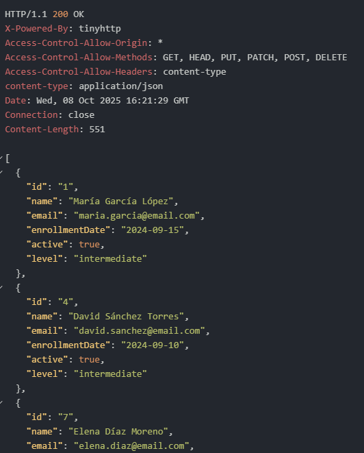

---

### 6. UPDATE Student (PUT)

Request a `{{apiUrl}}/2` para actualizar todos los campos del estudiante.

- En esta peticion se actualizan todos los campos de un estudiante en particular cuyo id es 2. El metodo utilizado es PUT. Y la URL completa se forma con las variables definidas al inicio del archivo.
- Es necesario incluir el header Content-Type para indicar que el body es de tipo JSON.

**Capturas ejemplo**:
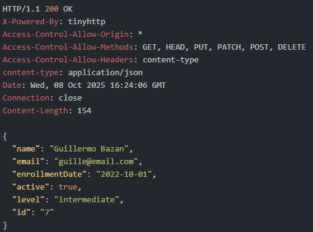

---

### 7. PATCH Student (PATCH)

Request a `{{apiUrl}}/2` para actualizar solo campos específicos (`Abdul Ramirez`).

- En esta peticion se actualizan solo algunos campos de un estudiante en particular cuyo id es 2. El metodo utilizado es PATCH. Y la URL completa se forma con las variables definidas al inicio del archivo.

**Capturas ejemplo**:
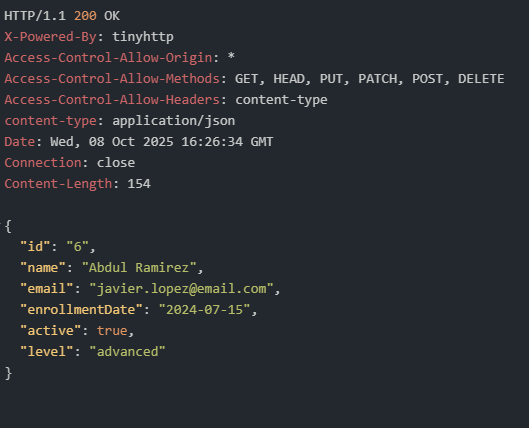

---

### 8. DELETE Student (DELETE)

Request a `{{apiUrl}}/3` para eliminar un estudiante de prueba.

- En esta peticion se elimina un estudiante en particular cuyo id es 3. El metodo utilizado es DELETE. Y la URL completa se forma con las variables definidas al inicio del archivo.

**Captura ejemplo**:
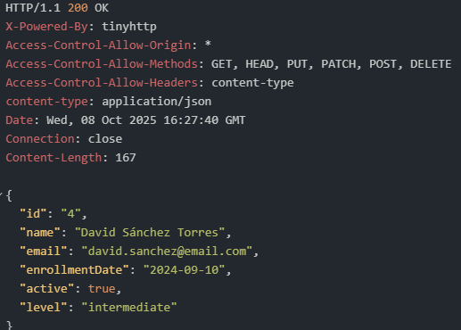

---

## 5.4 📝 Notas finales

1. Para ejecutar las pruebas:

   - Abrir `peticiones-crud.http` en VS Code.
   - Hacer clic en **Send Request** sobre cada petición.
  
2. Todas las variables (`@baseUrl`, `@port`, `@apiUrl`, `@ContentType`) se definen **dentro del archivo**.
3. Cada petición está separada con `###` y contiene comentarios explicativos.


# PARTE 6: Script de validación

- Este apartado está dedicado a la comprobación de los archivos y carpetas necesarios del proyecto, es decir, verifica que existen todos los ficheros, scripts y directorios requeridos para su correcta ejecución.
Además, comprueba que las dependencias listadas en el archivo package.json estén correctamente instaladas en el entorno local.

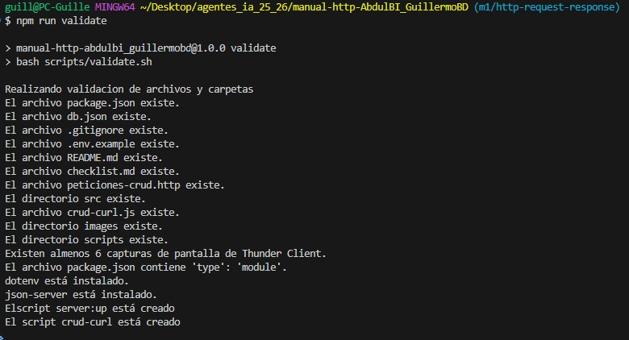