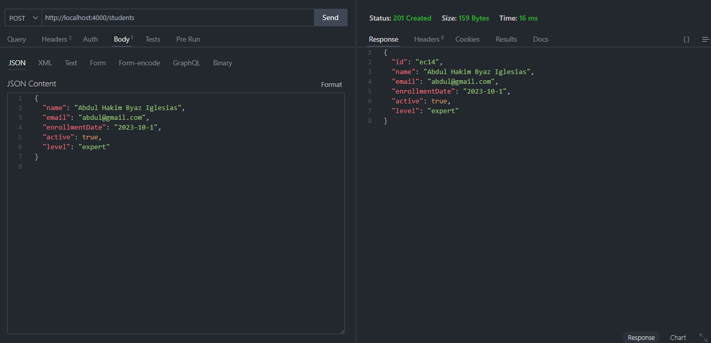
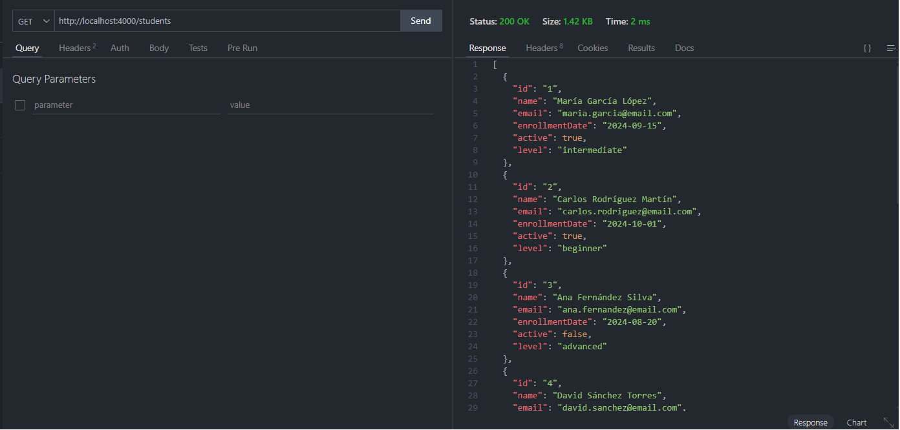
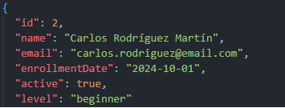
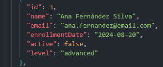
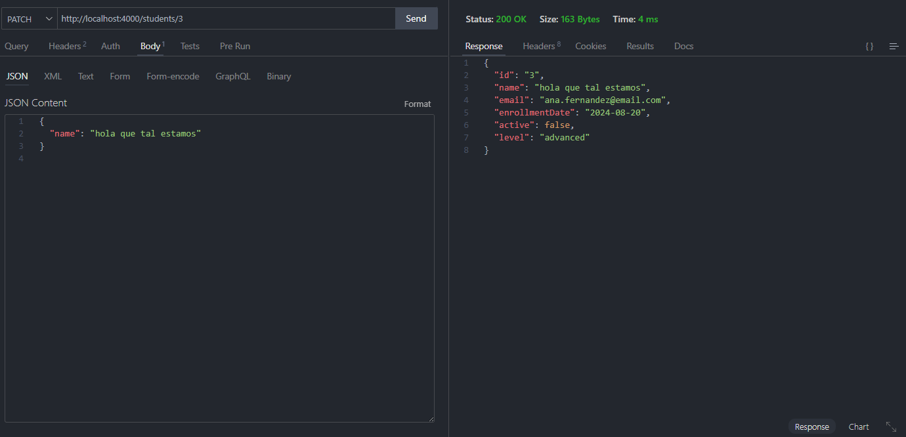

# Parte 4: Thunder Client – CRUD Students API

Este apartado muestra el desarrollo de las pruebas realizadas con **Thunder Client** para la API de estudiantes usando la base de datos `db.json`.

---

## 4.1 ⚙ Configuración

Dado que la versión free de Thunder Client **no permite colecciones ni entornos de variables**, todas las peticiones se realizaron directamente con la URL completa.

- **Base URL**: `http://localhost`
- **Puerto**: `4000`
- **Recurso principal**: `/students`
- **Recursos secundarios**: `/enrollments`

Ejemplo de endpoint completo:  

`http://localhost:4000/students`

---

## 4.2 📡 Peticiones

Se realizaron las siguientes peticiones HTTP contra la API de estudiantes:

1. **CREATE Student (POST)**
2. **GET All Students (GET)**
3. **GET Student by ID (GET)**
4. **UPDATE Student (PUT)**
5. **PATCH Student (PATCH)**
6. **DELETE Student (DELETE)**

---

## 4.3 📸 Capturas de pantalla

A continuación se muestran las capturas de pantalla de cada petición realizada con Thunder Client.

### 1. CREATE Student (POST)

Request a `http://localhost:4000/students` con body en formato JSON.  



Headers usados en la petición:


---

### 2. GET All Students (GET)

Request a `http://localhost:4000/students` para listar todos los estudiantes.  


---

### 3. GET Student by ID (GET)

Request a `http://localhost:4000/students/1` para consultar un estudiante en particular.  


---

### 4. UPDATE Student (PUT)

Request a `http://localhost:4000/students/2` con body JSON para reemplazar los datos de un estudiante.  

- Debido a que es una operación de reemplazo total, es necesario enviar todos los campos del recurso.

Los datos antes y después de la actualización son:




---

### 5. PATCH Student (PATCH)

Request a `http://localhost:4000/students/3` con body parcial en JSON para modificar solo algunos campos.  

- Solo se envían los campos que se desean actualizar.

Los datos antes y después de la actualización son:





---

### 6. DELETE Student (DELETE)

Request a `http://localhost:4000/enrollments/4` para eliminar un estudiante.  


---

## 4.4 📝 Documentación

Para usar Thunder Client con esta API:

1. Instalar la dependencia JSON Server si no está instalada:

   ```bash
   npm install -g json-server
    ```

2. Iniciar el servidor JSON Server con el archivo `db.json`:

   ```bash
   json-server --watch db.json --port 4000
   ```
